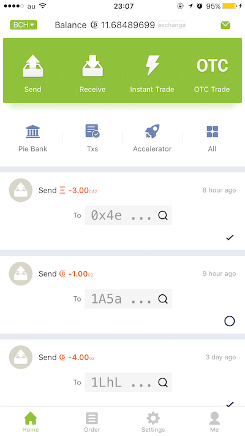

# 百币群签名指南

本教程为使用比特派进行签名入群验证指南

## 安装钱包

首先到 [Bitpie](http://bitpie.com/) 网站下载安装 Bitpie 钱包，安装教程在[这里](http://docs.bitpie.com/zh_CN/latest/download/index.html)。

切记保管好钱包的十二个单词的助记词，不要泄漏，否则你将无法找回你的比特币！

## 查看 BCH 地址

打开 Bitpie 钱包，点击左上角的小图标，选择 BCH 切换到 BCH 钱包模式。


然后在该模式下，点击 Receive 图标即可看到自己的 BCH 地址（例如我的是 ```15S6oKxrsrRCpNgM5y7NTXm4G9M446RAHh```，欢迎土豪打赏哈哈哈)。


确保该地址有足够的 BCH 后再进行以下操作。

## 生成签名信息

打开 http://100club.haipo.me/ 网页，输入你的微信 ID （例如我的是 imcoddy) 后点击 Query，进入下一个页面，提示的待签名信息是```imcoddy for BCH 100 Club```。


打开 Bitpie 的 Setting 设置页面，选择 Sign Message 选项，然后找到有足够币的地址。


点击进入后，输入上面的待签名信息```imcoddy for BCH 100 Club```。注意，输入的内容必须和待签名的内容需要完全相同，否则生成的信息会无法通过验证。
我的生成签名内容如下：```H47TMuEBxGL1mqxQ6mxWIbY4E3nQXOcVv6CnSt8Q0/VAWj5E2Yrp6jwDi+zGPhSk/dFfjWFLj4UAGabCrNp9bTc=```。


回到 http://100club.haipo.me/ 页面，输入地址信息和上面的签名内容，内容无误的情况下即可通过验证。


